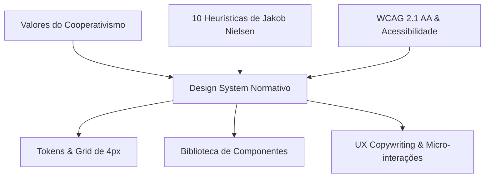

# 🎨 Design System & Diretrizes Normativas de UX — Coop Onboarding

> **Versão:** 1.0.0  
> **Status:** Canônico, Normativo & Mandatório  
> **Escopo:** Interface Frontend (`frontend/`), Biblioteca de Componentes, Padrões Visuais e Acessibilidade do Ecossistema Cooperativo.

---

## 🏛️ 1. Filosofia de Design & Heurísticas de UX

O Design System do **coop-onboarding** foi desenvolvido para unificar a sobriedade, transparência e cooperação mútua do cooperativismo de crédito com a agilidade e inovação da Inteligência Artificial Generativa e do RAG local.



### 1.1. As 10 Heurísticas de Usabilidade de Jakob Nielsen no Ecossistema

1. **Visibilidade do Status do Sistema:**
   - Feedback em tempo real para cada ação (salvamento de lição, envio de quiz, streaming do Tutor IA).
   - Barras de progresso com porcentagem legível (`role="progressbar"`), badges de status dinâmicos e skeleton screens durante o carregamento de dados.

2. **Compatibilidade entre o Sistema e o Mundo Real:**
   - Uso de vocabulário cooperativo autêntico ("Trilhas de Aprendizagem", "Turmas", "Colaborador", "Gestor", "Cooperativa").
   - Metáforas claras de progresso educacional e bancário sem jargões desnecessários.

3. **Controle e Liberdade do Usuário:**
   - Possibilidade de pausar ou retomar lições a qualquer momento sem perda de contexto.
   - Gaveta do Tutor IA e modais com botões de fechar evidentes, suporte nativo ao clique no backdrop e tecla `ESC`.
   - Seletor de perfis RBAC instantâneo para alternar perfis sem travamentos.

4. **Consistência e Padrões:**
   - Padrão uniforme de cores, tipografia, bordas e espaçamentos em todas as rotas da aplicação.
   - Posições previsíveis de elementos estruturais (AppHeader fixo no topo, Tutor IA flutuante no canto inferior direito, Rodapé corporativo padronizado).

5. **Prevenção de Erros:**
   - Desativação de botões com indicação clara de estados pendentes antes da submissão de questionários.
   - Destaque em vermelho apenas para ações irreversíveis ou formulários com pendências críticas.

6. **Reconhecimento em vez de Memorização:**
   - Sugestões de perguntas rápidas (chips clicáveis) na gaveta do Tutor IA.
   - Identificação contextual explícita da trilha ativa e lição em andamento em cabeçalhos de tela.

7. **Flexibilidade e Eficiência de Uso:**
   - Acesso rápido para usuários avançados, gestores e administradores (painel de métricas e filtros rápidos).
   - Atalhos táteis confortáveis para usuários em dispositivos desktop ou tablets.

8. **Estética e Design Minimalista:**
   - Eliminação de elementos supérfluos, ruídos gráficos ou "dark patterns".
   - Hierarquia clara com respiros generosos e ênfase no conteúdo de aprendizagem.

9. **Auxílio aos Usuários no Reconhecimento, Diagnóstico e Recuperação de Erros:**
   - Mensagens de erro com tom empático e explicativo, acompanhadas da ação de correção sugerida (ex: botão "Tentar Novamente" ou link para "Suporte ao Colaborador").

10. **Ajuda e Documentação:**
    - Tutor Virtual de IA contextual disponível em todas as telas com busca RAG normativa.
    - Telas institucionais de fácil acesso: Código de Conduta, Segurança & Privacidade e Central de Suporte.

### 1.2. Acessibilidade Universal (WCAG 2.1 AA)

- **Contraste Mínimo Mandatório:**
  * Razão de contraste mínima de **4.5:1** para texto normal e **3:1** para texto grande (≥ 18pt ou 14pt negrito) e componentes de interface interativos.
- **Touch Targets Mínimos:**
  * Área clicável mínima de **44 × 44px** em todos os botões, links móveis e ícones acionáveis.
- **Acessibilidade Tátil e Visual:**
  * Estados de foco explícitos e não ambíguos: `focus-visible:outline-hidden focus-visible:ring-2 focus-visible:ring-coop-500 focus-visible:ring-offset-2`.
- **Semântica HTML e WAI-ARIA:**
  * Modais com `role="dialog"` e `aria-modal="true"`.
  * Barras de progresso com `role="progressbar"`, `aria-valuenow`, `aria-valuemin="0"` e `aria-valuemax="100"`.
  * Rótulos acessíveis em ícones puros com `aria-label` ou `sr-only`.

---

## 📐 2. Padrões de Espaçamento e Grid (Escala de 4px)

A interface segue rigorosamente o sistema de grid baseado em múltiplos de **4px**, garantindo proporção e cadência vertical:

| Valor | Tailwind Class | Aplicação Principal no Sistema |
| :--- | :--- | :--- |
| **4px** | `p-1`, `gap-1`, `m-1` | Micromargens, paddings internos de badges compactas |
| **8px** | `p-2`, `gap-2`, `m-2` | Espaçamento entre ícone e texto, botões de ação compactos |
| **12px** | `p-3`, `gap-3`, `m-3` | Padding interno de inputs de formulário e botões de cabeçalho |
| **16px** | `p-4`, `gap-4`, `m-4` | Padding padrão de cards compactos, gap entre campos de formulário |
| **20px** | `p-5`, `gap-5`, `m-5` | Respiros internos de modais médios e cabeçalhos de gaveta |
| **24px** | `p-6`, `gap-6`, `m-6` | Padding de cards de trilha, painéis de lição e seções de gestão |
| **32px** | `p-8`, `gap-8`, `m-8` | Separação entre módulos principais do Dashboard |
| **40px** | `p-10`, `gap-10`, `m-10`| Espaçamento entre blocos temáticos extensos de conteúdo |
| **48px** | `p-12`, `gap-12`, `m-12`| Respiro vertical de telas de boas-vindas e seções hero |
| **64px** | `p-16`, `gap-16`, `m-16`| Espaçamento de topo em páginas corporativas institucionais |
| **80px** | `p-20`, `gap-20`, `m-20`| Espaçamento máximo de topo e fundo em páginas de apresentação |

### Margens de Container
- **Largura Máxima:** `max-w-7xl` (1280px) centralizado com `mx-auto`.
- **Padding Responsivo Obrigatório:** `px-4 sm:px-6 lg:px-8`.

---

## 🔤 3. Tipografia Canônica

### Famílias Tipográficas
- **Display & Headings:** `Plus Jakarta Sans`, com fallback para `Inter`, `system-ui`, `-apple-system`, `sans-serif`.
- **Corpo & Elementos de Formulário:** `Inter`, com fallback para `system-ui`, `-apple-system`, `sans-serif`.
- **Código & Dados Técnicos:** `ui-monospace`, `SFMono-Regular`, `Menlo`, `Monaco`, `Consolas`, `monospace`.

### Tabela de Pesos (Font Weights)

| Peso Numérico | Nome Canônico | Classes Tailwind | Uso Principal |
| :--- | :--- | :--- | :--- |
| **400** | Regular | `font-normal` | Corpo de texto longo, parágrafos de lições |
| **500** | Medium | `font-medium` | Rótulos de formulário, dados numéricos secundários |
| **600** | SemiBold | `font-semibold` | Subtítulos de cards, botões de ação primários |
| **700** | Bold | `font-bold` | Headings principais (H1, H2), indicadores de KPI |
| **800** | ExtraBold | `font-extrabold` | Títulos Display, saudações de boas-vindas e branding |

### Escala Modular de Tipografia

| Nível | Tamanho | Altura da Linha (Leading) | Peso | Tracking | Uso Canônico |
| :--- | :--- | :--- | :--- | :--- | :--- |
| **Display** | 36px (2.25rem) | 44px (2.75rem) | ExtraBold (800) | `-0.03em` | Saudação do Dashboard, Título Hero |
| **Heading 1 (H1)** | 28px (1.75rem) | 36px (2.25rem) | Bold (700) | `-0.025em` | Título de Trilha, Módulo ou Página |
| **Heading 2 (H2)** | 22px (1.375rem) | 28px (1.75rem) | Bold (700) | `-0.02em` | Títulos de Lições, Cabeçalhos de Gestão |
| **Heading 3 (H3)** | 18px (1.125rem) | 24px (1.5rem) | SemiBold (600) | `-0.015em` | Subtítulos de Cards, Título de Modais |
| **Body Large** | 16px (1rem) | 24px (1.5rem) | Regular / Medium | `normal` | Textos de leitura aprofundada de lições |
| **Body Base** | 14px (0.875rem) | 20px (1.25rem) | Regular / Medium | `normal` | Padrão da aplicação, cards e tabelas |
| **Caption** | 12px (0.75rem) | 16px (1rem) | Medium (500) | `+0.01em` | Metadados de trilha, tempo estimado |
| **Micro / Overline**| 10px (0.625rem) | 14px (0.875rem) | Bold (700) | `+0.05em` | Badges de papéis RBAC e categorias |

---

## 🎨 4. Paleta de Cores & Tokens de Design

### 4.1. Brand Verde Cooperativo
A cor mestre do cooperativismo de crédito. Inspira confiança, cooperação e equilíbrio financeiro:

| Token | Hex | Descrição de Uso | Relação de Contraste |
| :--- | :--- | :--- | :--- |
| `coop-50` | `#E6F4EA` | Fundo de badges ativas, superfícies destacadas | Texto `coop-800` |
| `coop-100` | `#C2E7CC` | Bordas suaves de containers cooperativos | Texto `coop-900` |
| `coop-200` | `#8ED5A3` | Bordas intermediárias e anéis de foco secundários | Texto `coop-950` |
| `coop-300` | `#55BE76` | Elementos gráficos e estados hover suaves | Texto `coop-950` |
| `coop-400` | `#29A752` | Ícones de apoio e estados ativos | Texto branco |
| `coop-500` | `#008751` | **Verde Cooperativo Canônico** — Botões primários, links ativos | Texto branco (4.6:1) |
| `coop-600` | `#008751` | Botões primários, ações principais do sistema | Texto branco (4.6:1) |
| `coop-700` | `#006E42` | Hover de botões primários e bordas ativas | Texto branco (5.8:1) |
| `coop-800` | `#005A36` | **Verde Cooperativo Profundo** — Títulos, ênfases de leitura | Fundo branco (8.4:1) |
| `coop-900` | `#00472B` | Textos em superfícies temáticas de alto contraste | Fundo branco (10.2:1) |
| `coop-950` | `#002919` | Linhas de base institucionais e ênfase máxima | Fundo branco (14.1:1) |

### 4.2. Tokens Cognitivos de IA (Tutor & Quiz)
Utilizados estritamente para recursos impulsionados por Inteligência Artificial (Tutor Virtual RAG, gerador de questionários sob demanda e diagnósticos adaptativos):

| Token | Hex | Aplicação Específica |
| :--- | :--- | :--- |
| `ai-50` | `#EEF2FF` | Superfície suave de mensagens do Tutor IA |
| `ai-100` | `#E0E7FF` | Bordas de chips de perguntas sugeridas |
| `ai-500` | `#6366F1` | Gradiente inicial do acionador do Tutor IA (`indigo-500`) |
| `ai-600` | `#4F46E5` | Ação primária no módulo de IA e hover (`indigo-600`) |
| `ai-700` | `#4338CA` | Hover aprofundado e foco em controles cognitivos |
| `ai-violet` | `#8B5CF6` | Gradiente secundário e badges de Quiz Gerado por IA |

### 4.3. Apoio Neutro (Slate Foundation)
Garante contraste confortável, suporte a leitura prolongada e hierarquia limpa:

| Token | Hex | Aplicação no Sistema |
| :--- | :--- | :--- |
| `slate-50` | `#F8FAFC` | Plano de fundo geral da aplicação (`body`) |
| `slate-100` | `#F1F5F9` | Fundos de cards neutros, cabeçalhos de tabela |
| `slate-200` | `#E2E8F0` | Linhas divisórias, bordas de cards e inputs |
| `slate-300` | `#CBD5E1` | Bordas em hover e controles desativados |
| `slate-400` | `#94A3B8` | Ícones secundários, placeholders e textos desabilitados |
| `slate-500` | `#64748B` | Metadados, subtítulos e textos de suporte |
| `slate-600` | `#475569` | Rótulos de formulário e textos de descrição |
| `slate-700` | `#334155` | Corpo de texto principal e parágrafos normativos |
| `slate-800` | `#1E293B` | Títulos intermediários e cartões em destaque |
| `slate-900` | `#0F172A` | Títulos de página e elementos de máximo contraste |
| `slate-950` | `#020617` | Contrastes extremos de tipografia e modais escuros |

### 4.4. Feedback Semântico

| Tipo | Hex Base | Fundo Suave | Texto de Contraste | Borda Normativa |
| :--- | :--- | :--- | :--- | :--- |
| **Sucesso** | `#10B981` (Emerald) | `#ECFDF5` | `#065F46` | `#A7F3D0` |
| **Alerta** | `#F59E0B` (Amber) | `#FFFBEB` | `#92400E` | `#FDE68A` |
| **Erro** | `#EF4444` (Rose) | `#FEF2F2` | `#991B1B` | `#FECACA` |
| **Info** | `#0EA5E9` (Sky) | `#F0F9FF` | `#075985` | `#BAE6FD` |

### 4.5. Badges de Papéis RBAC (Keycloak Roles)

| Papel | Classes Tailwind | Paleta Aplicada |
| :--- | :--- | :--- |
| **Colaborador** | `bg-coop-50 text-coop-700 border border-coop-200` | Fundo `#E6F4EA` \| Texto `#005A36` \| Borda `#C2E7CC` |
| **Gestor** | `bg-indigo-50 text-indigo-700 border border-indigo-200` | Fundo `#EEF2FF` \| Texto `#4338CA` \| Borda `#C7D2FE` |
| **Admin** | `bg-rose-50 text-rose-700 border border-rose-200` | Fundo `#FFF1F2` \| Texto `#BE123C` \| Borda `#FECDD3` |

---

## ✨ 5. Elementos Visuais de UX Design

### 5.1. Bordas e Raios (Border Radii)
- `rounded-lg` (8px): Badges, tooltips, tags de lição, checkboxes e switches.
- `rounded-xl` (12px): Botões de ação, inputs de formulário, itens de menus suspensos.
- `rounded-2xl` (16px): Cards de trilha, painéis de módulo, cartões de lição e KPIs.
- `rounded-3xl` (24px): Modais centrados, gaveta lateral do Tutor IA e containers de destaque.
- `rounded-full` (9999px): Avatares de perfil, pílulas de status, barras de progresso.

### 5.2. Elevações e Sombras (Shadows)
- `shadow-xs`: `0 1px 2px 0 rgba(0, 0, 0, 0.05)` — Cards de métricas rasos e bordas sutis.
- `shadow-sm`: `0 1px 3px 0 rgba(0, 0, 0, 0.1)` — Botões secundários e inputs em repouso.
- `shadow-md`: `0 4px 6px -1px rgba(0, 0, 0, 0.1)` — Cards interativos e barras de ferramentas.
- `shadow-lg`: `0 10px 15px -3px rgba(0, 0, 0, 0.1)` — Dropdowns de menu e cards em hover.
- `shadow-xl`: `0 20px 25px -5px rgba(0, 0, 0, 0.1)` — Modais e gaveta do Tutor IA.
- `shadow-ai`: `0 10px 25px -5px rgba(99, 102, 241, 0.3)` — Botão flutuante do Tutor IA e cartões cognitivos.

### 5.3. Micro-interações e Motion Thesis (Tese de Movimento)
- **Durações Canônicas:**
  * **150ms:** Micro-interações táteis, hover de botões e links (`transition-all duration-150 ease-out`).
  * **200ms:** Abertura e fechamento de modais centrados (`transition-all duration-200 cubic-bezier(0.16, 1, 0.3, 1)`).
  * **250ms:** Deslizamento da gaveta do Tutor IA (`AiTutorDrawer`) e transições entre abas (`transition-transform duration-250 ease-in-out`).
- **Respostas Hápticas de Escala:**
  * `hover:scale-[1.02]`: Elevação receptiva sutil para cartões e botões primários.
  * `active:scale-[0.98]`: Compressão física tátil indicando confirmação imediata do clique.
- **Prefers-Reduced-Motion:**
  * Toda animação deve respeitar `@media (prefers-reduced-motion: reduce)`, desativando transições de escala e movimentos abruptos para usuários sensíveis.

### 5.4. Prevenção de CLS (Cumulative Layout Shift) com Skeleton Screens
- Durante chamadas assíncronas (carregamento de trilhas, autenticação e histórico de quizzes), o componente `<SkeletonLoader>` é exibido no lugar do conteúdo real, preservando as dimensões exatas de largura e altura.
- Padrão visual: pulso cinza suave `animate-pulse bg-slate-200 rounded-xl` sem deslocamento de layout.

---

## 🧩 6. Anatomia de Componentes Canônicos

### 6.1. Botões de Ação
- **Botão Primário Cooperativo:**
  ```html
  <button class="inline-flex items-center space-x-2 px-4 py-2.5 rounded-xl font-semibold text-sm bg-coop-600 hover:bg-coop-700 text-white shadow-sm hover:shadow transition-all duration-150 active:scale-[0.98] focus-visible:outline-hidden focus-visible:ring-2 focus-visible:ring-coop-500 focus-visible:ring-offset-2">
    <span>Iniciar Trilha</span>
  </button>
  ```
- **Botão Cognitivo de IA:**
  ```html
  <button class="inline-flex items-center space-x-2 px-4 py-2.5 rounded-xl font-semibold text-sm bg-gradient-to-r from-ai-500 to-indigo-600 hover:from-ai-600 hover:to-indigo-700 text-white shadow-md shadow-ai-500/20 transition-all duration-150 hover:scale-[1.02] active:scale-[0.98]">
    <Sparkles class="w-4 h-4" />
    <span>Tutor IA</span>
  </button>
  ```
- **Botão Secundário Outline:**
  ```html
  <button class="inline-flex items-center space-x-2 px-4 py-2.5 rounded-xl font-medium text-sm border border-slate-200 bg-white hover:bg-slate-50 text-slate-700 shadow-xs transition-colors">
    <span>Voltar ao Painel</span>
  </button>
  ```

### 6.2. Card de Trilha de Aprendizagem
- Borda: `border border-slate-200/80 hover:border-coop-300`.
- Cantos: `rounded-2xl`.
- Sombra: `shadow-xs hover:shadow-md`.
- Transição: `transition-all duration-200`.

### 6.3. Barra de Progresso (`ProgressBar`)
- Trilha: `h-2 bg-slate-200/80 rounded-full overflow-hidden`.
- Preenchimento: `transition-all duration-500 ease-out`.
- Variantes: `from-coop-500 to-coop-700` (Cooperativa) ou `from-ai-500 to-indigo-600` (Cognitiva).

---

## ✍️ 7. Diretrizes de Redação & UX Copywriting

1. **Acolhimento & Cooperação:**
   - Usar frases centradas em pessoas: *"Bem-vindo à nossa cooperativa"*, *"Sua jornada de integração começa aqui"*.
2. **Clareza & Concisão:**
   - Evitar termos bancários obscuros sem explicação ou apoio do Tutor IA.
3. **Verbos de Ação Assertivos:**
   - Usar verbos diretos no infinitivo: *"Concluir Lição"*, *"Iniciar Quiz"*, *"Falar com Tutor IA"*.
4. **Mensagens Semânticas Empáticas:**
   - Sucesso: *"Parabéns! Você completou a trilha com sucesso."*
   - Erro: *"Não foi possível salvar o seu progresso. Verifique sua conexão e tente novamente."*

---

*Documento normativo homologado pelo Arquiteto de Sistemas de Conhecimento e Engenheiro Frontend do Ecossistema Coop Onboarding.*
