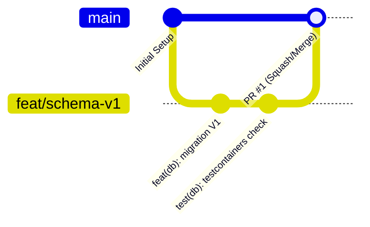

# 🛠️ DEVELOPMENT.md — Diretrizes de Engenharia e Governança

> Este documento define os padrões obrigatórios de arquitetura, versionamento e garantia de qualidade para o ecossistema **coop-onboarding**, fundamentado na metodologia **`senior-ai-dev-workflow`**.

---

## 🏛️ 1. Pilares de Arquitetura & Código

### A. Separação de Camadas (Clean Architecture / Hexagonal)
O backend (`backend/src/main/java/com/coop/onboarding/`) adota uma estrutura orientada a domínios com isolamento estrito:

1. **Domain (`domain/`)**:
   - Contém entidades puras de negócio, Value Objects e regras invariantes.
   - **Regra de Ouro:** Não deve depender de bibliotecas de infraestrutura, JPA (`jakarta.persistence`), Spring Framework ou Jackson.
2. **Application (`application/`)**:
   - Contém Use Cases (Casos de Uso) e orquestradores de regras de negócio.
   - Comunica-se com o mundo externo através de interfaces (Portas de Saída).
3. **Infrastructure (`infrastructure/`)**:
   - Contém os adaptadores tecnológicos: Entidades de persistência JPA, Repositórios, integrações com Spring AI / pgvector, Spring Security e Controllers REST.

### B. Regra de Governança de Banco de Dados
- **Zero DDL Automático:** `spring.jpa.hibernate.ddl-auto` deve permanecer em `validate`.
- Todas as alterações estruturais devem ser versionadas em scripts imutáveis do **Flyway** (`db/migration/V{numero}__{descricao}.sql`).

---

## 🌿 2. Fluxo de Versionamento Git (Issue-First)

Nenhum código entra na branch `main` sem passar pelo fluxo de governança:

### Regras Mandatórias:
1. **Issue First:** Toda funcionalidade ou correção de bug DEVE ter uma GitHub Issue aberta contendo:
   - Declaração do Problema.
   - Design Técnico.
   - Critérios de Aceite (*Acceptance Criteria*).
2. **Branches Isoladas:**
   - Features: `feat/<nome-curto>`
   - Correções: `fix/<nome-curto>`
   - Refatoração: `refactor/<nome-curto>`
3. **Commits Semânticos (Conventional Commits):**
   - Formato: `feat(escopo): descrição`, `fix(escopo): descrição`, `chore(...)`, `test(...)`.
4. **Pull Requests (PR):**
   - O PR deve referenciar a Issue (`Closes #<id>`).
   - Todos os testes de integração e linters devem passar antes do merge.

---

## 🧪 3. Qualidade & Pirâmide de Testes

- **Testes Unitários:** Foco nas regras de negócio da camada de Domínio e Casos de Uso.
- **Testes de Arquitetura (ArchUnit):** Garantem que as regras de dependência de camadas não sejam violadas.
- **Testes de Integração (Testcontainers):**
  - Todo teste de persistência ou Spring Boot context DEVE executar contra instâncias reais do PostgreSQL e pgvector gerenciadas via Testcontainers.
  - É proibido o uso de bancos H2 em memória para simular o PostgreSQL/pgvector.

---

## 🤖 4. Padrões de IA & RAG Local

- **Privacidade de Dados:** Inferência primária via modelos locais (Ollama / `llama3.2:3b` e `nomic-embed-text`).
- **Metadata Filtering:** Todo vetor salvo no `vector_store` deve obrigatoriamente registrar os metadados contextuais (`trackId`, `moduleId`, `lessonId`, `documentType`) para prevenir poluição de contexto no RAG.
