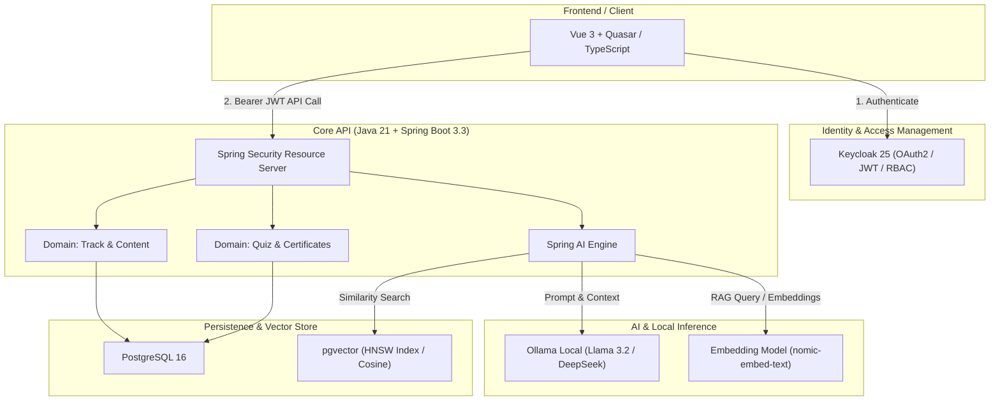

# 🎓 coop-onboarding

> **Plataforma Corporativa de Treinamento e Onboarding de Novos Colaboradores com IA Generativa Local (RAG) e Segurança Corporativa (Keycloak RBAC).**

[](https://openjdk.org/)
[](https://spring.io/projects/spring-boot)
[](https://spring.io/projects/spring-ai)
[](https://github.com/pgvector/pgvector)
[](https://www.keycloak.org/)
[](https://www.docker.com/)

---

## 🏛️ Visão Geral & Proposta de Valor

O **coop-onboarding** é uma plataforma corporativa desenvolvida para transformar e acelerar a integração de novos colaboradores em cooperativas e empresas com fluxos operacionais complexos. 

Combinando os padrões rigorosos de segurança e resiliência da arquitetura enterprise em **Java 21 / Spring Boot 3** com a vanguarda de **IA Generativa Local e RAG Semântico via Spring AI + pgvector**, o sistema oferece:

- 🧭 **Trilhas de Aprendizagem Adaptativas:** Conteúdos organizados por cargo e área com SLAs de conclusão e métricas de desempenho.
- 🤖 **Tutor Virtual de Onboarding (RAG 100% On-Premise):** Assistente inteligente que responde dúvidas pontuais sobre manuais, processos e normas internas sem enviar dados sensíveis para nuvens de terceiros.
- 📝 **Geração Automatizada de Quizzes:** Criação de testes de fixação instantâneos a partir dos materiais e lições cadastradas.
- 🔒 **Governança & Segurança Corporativa:** Autenticação e autorização unificadas via **Keycloak (OAuth2 / OpenID Connect)** com controle de acesso baseado em papéis (`ADMIN`, `GESTOR`, `COLABORADOR`).

---

## 🏗️ Arquitetura do Sistema



---

## 🚀 Como Executar o Ambiente Local

### Pré-requisitos
- **Java 21 LTS**
- **Docker & Docker Compose**
- **Ollama** com os modelos:
  ```bash
  ollama pull nomic-embed-text
  ollama pull llama3.2:3b
  ```

### 1. Subir Infraestrutura (PostgreSQL + pgvector e Keycloak)
Na raiz do projeto:
```bash
docker compose -f docker/docker-compose.yml up -d
```
- **PostgreSQL:** `localhost:5432` (Database: `coop_onboarding`, Usuário: `coop_user`, Senha: `coop_pass`)
- **Keycloak:** `http://localhost:8180` (Admin: `admin`, Senha: `admin`)

### 2. Executar o Backend
Entre na pasta do backend:
```bash
cd backend
./mvnw spring-boot:run
```
A API iniciará em `http://localhost:8080`.

### 3. Rodar Testes com Testcontainers
```bash
./mvnw clean test
```

---

## 🗺️ Roadmap de Desenvolvimento

- [x] **Fase 0: Setup de Infraestrutura & Ambiente** (Docker, pgvector, Keycloak, Java 21, Spring Boot 3.3)
- [ ] **Fase 1: Modelagem de Dados & Flyway Migrations** (Tabelas de Trilhas, Módulos, Aulas, Quizzes)
- [ ] **Fase 2: Configuração de Segurança Keycloak RBAC** (JwtAuthenticationConverter, Roles e Endpoints protegidos)
- [ ] **Fase 3: RAG e Ingestão de Documentos com Spring AI** (Criação do Tutor e Geração de Quizzes)
- [ ] **Fase 4: Frontend SPA em Vue 3 + Quasar** (Dashboard, Visualizador de Lição e Chatbot)

---

## 📄 Licença

Distribuído sob a licença MIT. Veja `LICENSE` para mais detalhes.
