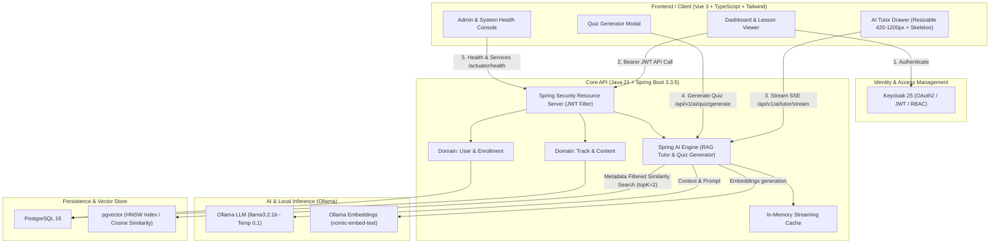

# 🎓 coop-onboarding

> **Plataforma Corporativa de Treinamento e Onboarding de Novos Colaboradores com IA Generativa Local (RAG), Segurança Corporativa (Keycloak RBAC) e SPA Moderna em Vue 3.**

[](https://openjdk.org/)
[](https://spring.io/projects/spring-boot)
[](https://spring.io/projects/spring-ai)
[](https://vuejs.org/)
[](https://www.typescriptlang.org/)
[](https://tailwindcss.com/)
[](https://github.com/pgvector/pgvector)
[](https://www.keycloak.org/)
[](https://ollama.com/)
[](https://www.docker.com/)

---

## 🏛️ Visão Geral & Proposta de Valor

O **coop-onboarding** é uma plataforma corporativa completa desenvolvida para transformar e acelerar a integração de novos colaboradores em cooperativas e empresas com fluxos operacionais e regulatórios complexos.

Combinando os padrões rigorosos de segurança e resiliência da arquitetura enterprise em **Java 21 / Spring Boot 3** com a vanguarda de **IA Generativa Local e RAG Semântico via Spring AI + pgvector** e uma interface fluida em **Vue 3 + TypeScript**, o sistema oferece:

- 🧭 **Trilhas de Aprendizagem Adaptativas:** Conteúdos organizados por cargo e área com SLAs de conclusão e métricas de desempenho.
- 🤖 **Tutor Virtual de Onboarding (RAG 100% On-Premise):** Assistente inteligente que responde dúvidas pontuais sobre manuais, processos e normas internas sem enviar dados sensíveis para nuvens de terceiros, citando as fontes normativas.
- ⚡ **Inferência Otimizada & Streaming SSE:** Respostas em tempo real via Server-Sent Events alimentadas pelo modelo ultraleve **`llama3.2:1b`** com embeddings `nomic-embed-text` e cache em memória de alta performance.
- 📝 **Geração Automatizada de Quizzes:** Criação instantânea de testes pedagógicos de fixação de múltipla escolha com gabarito e justificativa a partir dos materiais cadastrados.
- 🔒 **Governança & Segurança Corporativa:** Autenticação e autorização unificadas via **Keycloak (OAuth2 / OpenID Connect)** com controle de acesso granular baseado em papéis (`ROLE_ADMIN`, `ROLE_GESTOR`, `ROLE_COLABORADOR`).
- 🎨 **Experiência de Usuário de Alta Performance:** SPA responsiva construída com design system corporativo, zero layout shift (CLS), gaveta lateral interativa do Tutor de IA com largura redimensionável (420px a 1200px), card de carregamento skeleton animado e Guia Rápido contextual.

---

## 👥 Credenciais & Perfis de Acesso

O ambiente corporativo já vem pré-configurado com 3 perfis completos no Keycloak:

| Usuário | Senha | Papel (Role) | Escopo de Acesso & Funcionalidades |
| :--- | :--- | :--- | :--- |
| **`colaborador`** | `colab123` | `ROLE_COLABORADOR` | **Experiência do Aprendiz:** Acesso às trilhas de formação, leitor imersivo de lições, **Guia Rápido de Onboarding**, realização de quizzes de fixação e **Tutor IA** em tempo real com streaming. |
| **`gestor`** | `gestor123` | `ROLE_GESTOR` | **Gestão de Equipe & Aprendizado:** Dashboard analítico de desempenho dos colaboradores da equipe, acompanhamento de taxas de conclusão, consulta pedagógica de trilhas e gerador de quizzes via IA. |
| **`admin`** | `admin123` | `ROLE_ADMIN` | **Super Administrador:** Possui **todos os privilégios de Gestor** (consulta pedagógica de trilhas, geração de quizzes) **+ Painel de Administração e Governança do Sistema** (status do PostgreSQL/pgvector, métricas da IA local Ollama, Ray Cloud status e auditoria). |

---

## 🏗️ Arquitetura do Sistema



---

## 🤖 Engenharia de IA Local & Otimizações de Desempenho

A plataforma opera com inferência de IA 100% on-premise, garantindo conformidade total com a LGPD e privacidade corporativa:

1. **Modelo de Linguagem (LLM):** `llama3.2:1b` (1.3B parâmetros), selecionado por oferecer a melhor relação custo-benefício e velocidade em CPUs corporativas padrão sem exigir placa de vídeo dedicada.
2. **Modelo de Embeddings:** `nomic-embed-text` (768 dimensões), gerando representações semânticas precisas de regulamentos internos e cartilhas de cooperativismo.
3. **Busca Vetorial Segmentada (`pgvector`):** Utiliza metadados estritos (`lessonId`, `trackId`, `documentType`) e índice HNSW com métrica de cosseno, limitando o `topK` em 2 fragmentos essenciais para cortar a latência de pré-avaliação do prompt para menos de 1.5 segundo.
4. **Streaming SSE sem Regressão de Espaços:** Endpoint reativo `/api/v1/ai/tutor/stream` consumido em tempo real, preservando espaçamento natural de palavras e renderizando blocos Markdown com suporte a cópia rápida.
5. **Cache em Memória de Streaming:** Perguntas repetidas são servidas imediatamente do cache em ~2 segundos com consumo zero de CPU do modelo.
6. **Card Skeleton Animado:** Substituição de bolhas vazias por indicador de progresso estruturado com animação *shimmer*, status do modelo ativo e etapas da busca normativa.

---

## 🚀 Como Executar o Ecossistema Completo

### Pré-requisitos
- **Java 21 LTS**
- **Node.js 20+**
- **Docker & Docker Compose**
- **Ollama** com os modelos baixados:
  ```bash
  ollama pull nomic-embed-text
  ollama pull llama3.2:1b
  ```

---

### 1. Subir Infraestrutura (PostgreSQL + pgvector e Keycloak)
Na raiz do projeto:
```bash
docker compose -f docker/docker-compose.yml up -d
```
- **PostgreSQL:** `localhost:5432` (Database: `coop_onboarding`, Usuário: `coop_user`, Senha: `coop_pass`)
- **Keycloak:** `http://localhost:8180` (Realm `coop-onboarding` importado automaticamente com os 3 perfis prontos)

---

### 2. Executar o Backend (Spring Boot 3.3.5)
```bash
cd backend
./mvnw spring-boot:run
```
A API iniciará em `http://localhost:8080`.

#### Rodar Suíte Completa de Testes Automatizados (38 testes):
```bash
./mvnw clean test
```
*(Executa testes de conformidade arquitetural com ArchUnit, testes de integração com Testcontainers contra PostgreSQL + pgvector real e testes de segurança MockMvc).*

---

### 3. Executar o Frontend (Vue 3 + Vite)
Em outro terminal:
```bash
cd frontend
npm install
npm run dev
```
A interface iniciará em `http://localhost:5173`.

#### Compilar para Produção:
```bash
cd frontend
npm run build
```

---

### 4. Executar Testes E2E (Playwright)
Para validar o fluxo completo dos três perfis (`colaborador`, `gestor` e `admin`) e a interação do Tutor IA:
```bash
cd frontend
node test-all-roles.mjs
```

---

## 🗺️ Roadmap de Desenvolvimento Concluído

- [x] **Fase 0: Setup de Infraestrutura & Ambiente** (Docker, pgvector, Keycloak, Java 21, Spring Boot 3.3)
- [x] **Fase 1: Modelagem de Dados & Flyway Migrations** (Tabelas de Trilhas, Módulos, Aulas, Matrículas e tabela vetorial HNSW)
- [x] **Fase 2: Configuração de Segurança Keycloak RBAC** (JwtAuthenticationConverter, Roles e Endpoints protegidos)
- [x] **Fase 3: RAG e Ingestão de Documentos com Spring AI** (Chunking com TokenTextSplitter, Tutor RAG filtrado por aula e Gerador de Quizzes estruturados)
- [x] **Fase 4: Frontend Corporativo SPA em Vue 3** (Dashboard de progresso, Leitor de Lições, AI Tutor Drawer e Modal de Quizzes)
- [x] **Fase 5: Otimizações de IA e Experiência do Usuário (UX/UI)**:
  - Redimensionamento interativo da tela de chat (420px a 1200px) com persistência de layout;
  - Adoção do modelo ultraleve `llama3.2:1b` e hiperparâmetros de baixa latência;
  - Resolução definitiva de espaçamento de palavras em streaming SSE;
  - Fase de carregamento com *Skeleton Shimmer Card*;
  - Guia Rápido contextual exclusivo para perfil Colaborador;
  - Console de status de serviços e base vetorial para perfil Admin.

---

## 📜 Governança e Qualidade
Este projeto foi concebido e implementado seguindo a metodologia **[senior-ai-dev-workflow](https://github.com/raguiohead/senior-ai-dev-workflow)**:
- Política estrita de **Issue First** e branches isoladas de feature.
- **Commits Semânticos** convencionais.
- Separação de camadas validada por **ArchUnit**.
- Testes de integração reais via **Testcontainers**.
- Princípios de **frontend-design** para interfaces corporativas autorais.
Consulte [DEVELOPMENT.md](file:///mnt/HD-13/projects/coop-onboarding/DEVELOPMENT.md) para detalhes de arquitetura.

---

## 📄 Licença

Distribuído sob a licença MIT. Veja `LICENSE` para mais detalhes.
