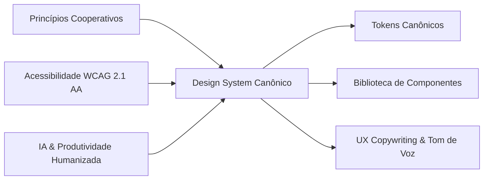

# 🎨 Design System Canônico — Coop Onboarding

> **Versão:** 1.0.0  
> **Status:** Canônico & Ativo  
> **Aplicações:** `frontend` (Vue 3 + TypeScript + TailwindCSS), Comunicações e Extensões do Ecossistema Cooperativo.

---

## 🏛️ 1. Filosofia de Design & Princípios de UX

O Design System do **coop-onboarding** foi concebido para expressar a identidade de solidez, confiança e espírito comunitário do cooperativismo de crédito, integrando tecnologia de ponta (Inteligência Artificial Generativa e RAG local) em uma experiência de uso humana, ágil e acolhedora para novos colaboradores.



### 1.1. Pilares Norteadores

1. **Acessibilidade Universal (WCAG 2.1 Nível AA Obrigatório):**
   - **Contraste de Cor Rigoroso:** Razão mínima de contraste de 4.5:1 para texto normal e 3:1 para textos grandes (≥18pt ou 14pt negrito) e componentes interativos (botões, inputs, bordas ativas).
   - **Navegabilidade 100% por Teclado:** Ordem de tabulação lógica (`tabindex`), anéis de foco deliberados e visíveis (`focus-visible:ring-2 focus-visible:ring-coop-500 focus-visible:ring-offset-2`).
   - **Semântica e ARIA Completa:** Componentes dinâmicos como modais, gavetas e barras de progresso contam com roles e atributos normativos (`role="progressbar"`, `aria-valuenow`, `aria-expanded`, `role="dialog"`, `aria-modal="true"`).

2. **Clareza Cooperativa & Confiança:**
   - O cooperativismo é fundamentado na união de pessoas, ajuda mútua e transparência financeira. A interface reflete esses valores por meio de linhas limpas, espaços abertos, leitura desimpedida e ausência de elementos visuais agressivos ou enganosos (zero dark patterns).

3. **Densidade de Informação Balanceada:**
   - Evita tanto o vazio excessivo quanto o congestionamento cognitivo. Trilha de aprendizagem, lições técnicas e normativos regulatórios são dispostos com tipografia escaneável, respiros generosos e hierarquia visual evidente.
   - Touch targets mínimos de **44 × 44px** em áreas interativas de toque e cliques desktop confortáveis.

4. **Micro-interações Deliberadas & Hápticas:**
   - Cada animação possui um propósito funcional: orientar a atenção, validar uma ação ou reduzir a percepção de espera.
   - Estados bem calibrados: *Default*, *Hover* (elevação sutil + escala 1.02), *Active/Press* (compressão tátil 0.98), *Focus-Visible*, *Disabled* (opacidade 50%, cursor não permitido) e *Loading*.

5. **Motion Thesis (Tese de Movimento):**
   - **Micro-feedbacks e botões:** `150ms ease-out` (resposta instantânea).
   - **Gavetas, transições de abas e expansões:** `250ms cubic-bezier(0.16, 1, 0.3, 1)` (fluidez suave).
   - **Modais e diálogos centrados:** `200ms cubic-bezier(0.16, 1, 0.3, 1)` com escala sutil de 95% para 100%.
   - **Respeito a Preferências:** Toda transição respeita rigorosamente `@media (prefers-reduced-motion: reduce)`.

---

## 🌈 2. Design Tokens Canônicos

### 2.1. Cores Institucionais e Semânticas

#### A. Paleta Brand Verde Cooperativo
A identidade mestra da cooperativa. Representa prosperidade, sustentabilidade e união.

| Token | Hex | Uso Principal | Contraste Recomendado |
| :--- | :--- | :--- | :--- |
| `coop-50` | `#E6F4EA` | Fundo de badges ativas, superfícies de destaque suave | Texto `coop-800` |
| `coop-100` | `#C2E7CC` | Bordas suaves de containers cooperativos | Texto `coop-900` |
| `coop-200` | `#8ED5A3` | Destaques intermediários e borders em hover | Texto `coop-950` |
| `coop-300` | `#55BE76` | Elementos gráficos decorativos | Texto `coop-950` |
| `coop-400` | `#29A752` | Ícones de apoio e estados complementares | Texto branco |
| `coop-500` | `#008751` | **Verde Cooperativo Canônico** — Botões primários, links ativos | Texto branco (4.6:1) |
| `coop-600` | `#008751` | Ação primária / Hover refinado de botões principais | Texto branco |
| `coop-700` | `#006E42` | Estado active/pressed de botões e textos destacados | Texto branco |
| `coop-800` | `#005A36` | **Verde Cooperativo Profundo** — Títulos institucionais, contrastes fortes | Fundo `coop-50` / Branco |
| `coop-900` | `#00472B` | Textos escuros em superfícies temáticas | Fundo branco (10.2:1) |
| `coop-950` | `#002919` | Linhas de base e elementos de máxima ênfase | Fundo branco |

#### B. Paleta de Inteligência Artificial & Inovação (AI Tokens)
Utilizada exclusivamente para recursos impulsionados por Inteligência Artificial (Tutor Virtual RAG, gerador de quizzes automáticos, feedbacks adaptativos).

| Token | Hex | Aplicação |
| :--- | :--- | :--- |
| `ai-50` | `#EEF2FF` | Superfície suave de mensagens do Tutor IA |
| `ai-100` | `#E0E7FF` | Bordas e tags de perguntas sugeridas |
| `ai-500` | `#6366F1` | Gradiente base do acionador do Tutor IA |
| `ai-600` | `#4F46E5` | Ações primárias no módulo de IA |
| `ai-700` | `#4338CA` | Hover e foco em ferramentas cognitivas |
| `ai-violet` | `#8B5CF6` | Acento secundário para geração de quizzes |

#### C. Paleta Neutra de Apoio (Slate Foundation)
Garante contraste sereno, suporte a modo claro/escuro e alta legibilidade textual.

| Token | Hex | Aplicação |
| :--- | :--- | :--- |
| `slate-50` | `#F8FAFC` | Plano de fundo geral da aplicação (`body`) |
| `slate-100` | `#F1F5F9` | Fundos de cards neutros, blocos de código inline |
| `slate-200` | `#E2E8F0` | Divisórias e bordas padrão de cards e inputs |
| `slate-300` | `#CBD5E1` | Bordas em hover e controles inativos |
| `slate-400` | `#94A3B8` | Ícones secundários e placeholders |
| `slate-500` | `#64748B` | Metadados, subtítulos e legendas de suporte |
| `slate-600` | `#475569` | Rótulos de formulário e textos descritivos |
| `slate-700` | `#334155` | Corpo de texto principal e parágrafos normativos |
| `slate-800` | `#1E293B` | Títulos e textos de destaque |
| `slate-900` | `#0F172A` | Títulos de página e elementos de máximo contraste |

#### D. Paleta Semântica de Feedback

| Função | Cor Base | Hex | Tokens de Apoio |
| :--- | :--- | :--- | :--- |
| **Sucesso** | Emerald | `#10B981` | Fundo: `#ECFDF5` \| Texto: `#065F46` \| Borda: `#A7F3D0` |
| **Alerta** | Amber | `#F59E0B` | Fundo: `#FFFBEB` \| Texto: `#92400E` \| Borda: `#FDE68A` |
| **Perigo/Erro** | Rose | `#EF4444` | Fundo: `#FEF2F2` \| Texto: `#991B1B` \| Borda: `#FECACA` |
| **Info** | Sky | `#0EA5E9` | Fundo: `#F0F9FF` \| Texto: `#075985` \| Borda: `#BAE6FD` |

---

### 2.2. Tipografia Canônica

O ecossistema utiliza a família tipográfica moderna **Plus Jakarta Sans** (com fallback gracioso para **Inter** e sans-serif do sistema operacional).

```
font-family: 'Plus Jakarta Sans', Inter, system-ui, -apple-system, sans-serif;
```

#### Escala Modular de Tipografia

| Nível | Tamanho | Altura da Linha (Leading) | Peso | Tracking | Uso Canônico |
| :--- | :--- | :--- | :--- | :--- | :--- |
| **Display** | 36px (2.25rem) | 44px (2.75rem) | ExtraBold (800) | `-0.03em` | Títulos de boas-vindas do Dashboard |
| **Heading 1** | 28px (1.75rem) | 36px (2.25rem) | Bold (700) | `-0.025em` | Título de Trilha, Módulo ou Página |
| **Heading 2** | 22px (1.375rem) | 28px (1.75rem) | Bold (700) | `-0.02em` | Títulos de Lição e Seções de Gestão |
| **Heading 3** | 18px (1.125rem) | 24px (1.5rem) | SemiBold (600) | `-0.015em` | Subtítulos de cards e blocos temáticos |
| **Body Large** | 16px (1rem) | 24px (1.5rem) | Regular / Medium | `normal` | Textos de leitura de lições e introduções |
| **Body Base** | 14px (0.875rem) | 20px (1.25rem) | Regular / Medium | `normal` | Padrão da aplicação, cards e formulários |
| **Caption / Small** | 12px (0.75rem) | 16px (1rem) | Medium (500) | `+0.01em` | Metadados, tempo estimado, badges |
| **Micro / Overline**| 10px (0.625rem) | 14px (0.875rem) | Bold (700) | `+0.05em` | Badges de Role Keycloak em maiúsculas |

---

### 2.3. Espaçamento & Grid (Escala de 4px)

A interface opera em múltiplos de **4px**, garantindo alinhamento óptico absoluto e harmonia vertical:

```
4px   ->  p-1 / gap-1     (Micromargens, paddings de badges)
8px   ->  p-2 / gap-2     (Espaçamento entre ícone e texto, pequenos botões)
12px  ->  p-3 / gap-3     (Padding interno de inputs e botões compactos)
16px  ->  p-4 / gap-4     (Padding padrão de cards compactos e grids móveis)
24px  ->  p-6 / gap-6     (Padding de cards de trilhas e seções)
32px  ->  p-8 / gap-8     (Separação entre módulos do dashboard)
48px  ->  p-12 / gap-12   (Espaçamento entre grandes blocos de conteúdo)
64px  ->  p-16 / gap-16   (Hero headers e seções principais)
```

**Largura Máxima de Container:** `max-w-7xl` (1280px) centralizado com padding adaptativo (`px-4 sm:px-6 lg:px-8`).

---

### 2.4. Raios de Bordas (Border Radii) & Elevação (Sombras)

#### Raios de Borda
- `rounded-lg` (8px): Badges, tooltips, tags de lição e checkboxes.
- `rounded-xl` (12px): Botões, inputs de formulário, itens de menus dropdown.
- `rounded-2xl` (16px): Cards de trilha, cartões de lição, painéis do dashboard.
- `rounded-3xl` (24px): Modais, gaveta do Tutor IA e containers de destaque.
- `rounded-full` (9999px): Avatares de usuário, barras de progresso lineares e botões em formato pílula.

#### Elevação & Sombras
- `shadow-xs`: `0 1px 2px 0 rgba(0, 0, 0, 0.05)` — Cards de métricas rasos e bordas sutis.
- `shadow-sm`: `0 1px 3px 0 rgba(0, 0, 0, 0.1)` — Botões secundários e inputs em repouso.
- `shadow-md`: `0 4px 6px -1px rgba(0, 0, 0, 0.1)` — Cards interativos e barras de ferramentas.
- `shadow-lg`: `0 10px 15px -3px rgba(0, 0, 0, 0.1)` — Dropdowns e popovers de perfil.
- `shadow-xl`: `0 20px 25px -5px rgba(0, 0, 0, 0.1)` — Gavetas laterais (Tutor IA) e modais.
- `shadow-ai`: `0 10px 25px -5px rgba(99, 102, 241, 0.3)` — Botão flutuante do Tutor IA.

---

## 🧩 3. Componentes Canônicos e Anatomia

### 3.1. Botões (Buttons)

1. **Botão Primário Cooperativo:**
   - Classes: `bg-coop-600 hover:bg-coop-700 text-white font-semibold px-4 py-2.5 rounded-xl shadow-sm transition-all duration-200 active:scale-[0.98] focus-visible:ring-2 focus-visible:ring-coop-500`
   - Uso: Ação principal da tela (Iniciar Lição, Salvar Respostas, Confirmar Matrícula).

2. **Botão IA / Cognitive Action:**
   - Classes: `bg-gradient-to-r from-ai-500 to-indigo-600 hover:from-ai-600 hover:to-indigo-700 text-white font-semibold px-4 py-2.5 rounded-xl shadow-md shadow-ai-500/20 transition-all duration-200 hover:scale-[1.02] active:scale-[0.98]`
   - Uso: Disparar assistente de IA, gerar quiz sob demanda, resumir lição com RAG.

3. **Botão Secundário Outline:**
   - Classes: `border border-slate-200 bg-white hover:bg-slate-50 text-slate-700 font-medium px-4 py-2.5 rounded-xl shadow-xs transition-colors`
   - Uso: Ações secundárias, filtros, cancelamentos e navegações intermediárias.

4. **Botão Ghost / Discreto:**
   - Classes: `text-slate-600 hover:text-slate-900 hover:bg-slate-100 font-medium px-3 py-2 rounded-lg transition-colors`
   - Uso: Paginação, ações de cabeçalho, alternância de visualização.

5. **Botão Destrutivo / Danger:**
   - Classes: `bg-rose-600 hover:bg-rose-700 text-white font-semibold px-4 py-2.5 rounded-xl shadow-sm transition-colors`
   - Uso: Cancelar matrícula, reiniciar histórico, exclusão de dados.

---

### 3.2. Badges & Tags de Identificação

1. **Badges de Papel Keycloak (RBAC):**
   - `ADMIN`: `bg-rose-50 text-rose-700 border border-rose-200 text-[10px] font-bold uppercase tracking-wider px-2 py-0.5 rounded-md`
   - `GESTOR`: `bg-indigo-50 text-indigo-700 border border-indigo-200 text-[10px] font-bold uppercase tracking-wider px-2 py-0.5 rounded-md`
   - `COLABORADOR`: `bg-coop-50 text-coop-700 border border-coop-200 text-[10px] font-bold uppercase tracking-wider px-2 py-0.5 rounded-md`

2. **Status de Aprendizagem:**
   - `Concluído`: Badge esmeralda com ícone de check (`bg-emerald-50 text-emerald-700 border border-emerald-200`).
   - `Em Andamento`: Badge âmbar com ícone de relógio (`bg-amber-50 text-amber-700 border border-amber-200`).
   - `Não Iniciado`: Badge slate com ícone neutro (`bg-slate-100 text-slate-600 border border-slate-200`).

---

### 3.3. Cards & Containers de Conteúdo

1. **Card de Trilha de Aprendizagem:**
   - Anatomia: Imagem de capa com tag de categoria, barra de progresso embutida, contagem de lições, tempo estimado em minutos, botão de ação contextual.
   - Borda: `border border-slate-200/80 hover:border-coop-300`, canto `rounded-2xl`, transição de sombra `shadow-xs hover:shadow-md`.

2. **Card de Métrica / KPI:**
   - Indicador numérico em fonte Display ou Heading 1, ícone temático em container circular colorido, rótulo descritivo e comparativo de progresso.

---

### 3.4. Barra de Progresso (`ProgressBar`)

- Indicador linear estilizado com background `bg-slate-200/80` e preenchimento com transição elástica suave `transition-all duration-500 ease-out`.
- Variantes canônicas:
  * `coop`: Gradiente de `from-coop-500 to-coop-700`
  * `ai`: Gradiente de `from-ai-500 to-indigo-600`
  * `success`: Gradiente de `from-emerald-500 to-teal-500`
- Tamanhos: `sm` (h-1.5), `md` (h-2.5), `lg` (h-3.5).
- Acessibilidade: atributos `role="progressbar"`, `aria-valuenow`, `aria-valuemin="0"`, `aria-valuemax="100"`.

---

### 3.5. Gaveta Lateral do Tutor IA (`AiTutorDrawer`)

- **Posicionamento:** Fixado na lateral direita (`fixed inset-y-0 right-0 z-50 w-full sm:w-[480px]`).
- **Animação:** `transition-transform duration-300 ease-in-out` com entrada fluida a partir da direita.
- **Backdrop:** Camada translúcida `bg-slate-900/30 backdrop-blur-xs` com clique para fechar e suporte a tecla `ESC`.
- **Anatomia Interna:**
  * Header com identidade da IA, indicador de status online e botão de fechar acessível.
  * Context Tag informando lição ou tema ativo.
  * Chat log com balões diferenciados (Usuário vs Tutor IA com fontes normativas citadas).
  * Prompt box com textarea auto-ajustável e sugestões de perguntas em chips.

---

### 3.6. Skeleton Screens (Prevenção de CLS)

- Indicadores de carregamento com pulso suave `animate-pulse` substituem spinners invasivos.
- Formatos: Card Skeleton, Linhas de Texto multilinhas com larguras orgânicas (100%, 100%, 60%) e Avatares circulares.

---

## ✍️ 4. Tom de Voz & Redação de UI (UX Copywriting)

### 4.1. Pilares da Comunicação

1. **Acolhedor & Cooperativo:**  
   Em vez de termos frios e burocráticos ("Autentique-se no sistema"), prefira linguagem receptiva e humana ("Bem-vindo à nossa cooperativa", "Pronto para sua próxima etapa?").

2. **Claro & Sem Ambiguidade:**  
   Termos bancários ou regulatórios (BACEN, compliance, cooperativismo de crédito) devem ser acompanhados de explicações breves ou links rápidos para consulta com o Tutor IA.

3. **Verbos no Infinitivo ou Imperativo Ativo:**  
   Botões e links de ação devem usar verbos diretos:
   - ✅ *Iniciar trilha* / *Continuar de onde parou* / *Concluir lição* / *Consultar Tutor IA* / *Gerar Quiz*
   - ❌ *Clique aqui* / *Trilha* / *Envio de respostas*

4. **Feedback Semântico Empático:**
   - **Sucesso:** "Parabéns! Você concluiu o módulo com 100% de aproveitamento."
   - **Alerta:** "Faltam apenas 2 lições para cumprir o prazo recomendado desta trilha."
   - **Erro:** "Não foi possível carregar a lição. Verifique sua conexão ou tente novamente em instantes."

---

## 🛠️ 5. Guia Rápido de Implementação para Desenvolvedores

### Exemplo de Botão Canônico com Ícone
```vue
<button
  type="button"
  class="inline-flex items-center space-x-2 px-4 py-2.5 rounded-xl font-semibold text-sm bg-coop-600 hover:bg-coop-700 text-white shadow-sm hover:shadow transition-all duration-200 active:scale-[0.98] focus-visible:outline-hidden focus-visible:ring-2 focus-visible:ring-coop-500 focus-visible:ring-offset-2"
>
  <BookOpen class="w-4 h-4 text-white" />
  <span>Continuar Lição</span>
</button>
```

### Exemplo de Card de Trilha
```vue
<div class="bg-white rounded-2xl border border-slate-200/80 p-6 shadow-xs hover:shadow-md hover:border-coop-300 transition-all duration-300">
  <div class="flex items-center justify-between mb-4">
    <span class="px-2.5 py-1 rounded-lg text-xs font-semibold bg-coop-50 text-coop-700 border border-coop-200">
      Trilha Obrigatória
    </span>
    <span class="text-xs text-slate-500 flex items-center gap-1">
      <Clock class="w-3.5 h-3.5" /> 45 min
    </span>
  </div>
  <h3 class="text-lg font-bold text-slate-900 mb-2">Fundamentos do Cooperativismo</h3>
  <p class="text-sm text-slate-600 mb-6">Compreenda os 7 princípios universais e a estrutura das cooperativas de crédito.</p>
  <ProgressBar :value="60" variant="coop" show-label />
</div>
```

---
*Documento aprovado pelo Design System & UX Architect do ecossistema Coop Onboarding.*
